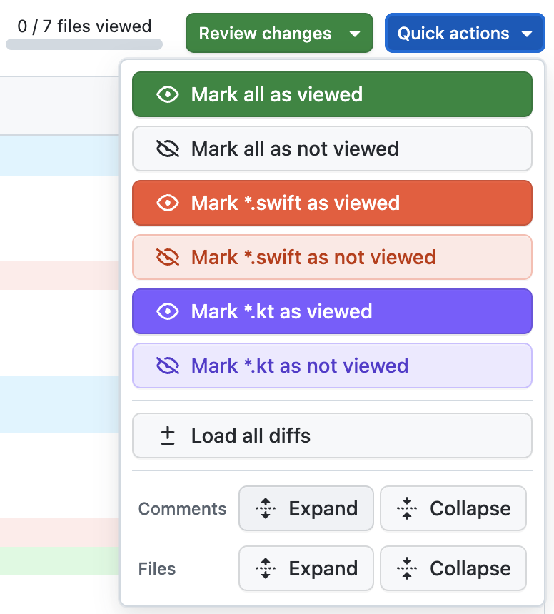

# GitHub PR Review Chrome Extension

A Chrome extension that adds a **Quick actions** button to GitHub pull request "Files changed" pages, giving reviewers one-click controls to manage file visibility and review state — especially useful for mixed-language codebases containing Swift and Kotlin files.

## Screenshot



## Features

The **Quick actions** dropdown injects directly into the GitHub PR toolbar and provides the following operations:

### Mark as viewed / not viewed

| Action | Description |
|--------|-------------|
| Mark all as viewed | Marks every file in the PR as viewed |
| Mark all as not viewed | Resets every file to unviewed |
| Mark `*.swift` as viewed | Marks only Swift source files as viewed |
| Mark `*.swift` as not viewed | Resets only Swift source files to unviewed |
| Mark `*.kt` as viewed | Marks only Kotlin source files as viewed |
| Mark `*.kt` as not viewed | Resets only Kotlin source files to unviewed |

### Diffs

| Action | Description |
|--------|-------------|
| Load all diffs | Triggers loading of every diff that was deferred by GitHub |

### Comments

| Action | Description |
|--------|-------------|
| Comments → Expand | Expands all inline review comment threads |
| Comments → Collapse | Collapses all inline review comment threads |

### Files

| Action | Description |
|--------|-------------|
| Files → Expand | Expands all collapsed file diffs |
| Files → Collapse | Collapses all expanded file diffs |

## Why this is useful for Swift / Kotlin code reviews

Large mobile PRs often mix Swift (iOS) and Kotlin (Android) changes. The per-language mark-as-viewed buttons let you:

- **Focus on one platform at a time** — mark all `.kt` files as viewed while you concentrate on the Swift side, then flip to Kotlin without losing your place.
- **Split review duties** — an iOS reviewer can mark all `.swift` files as viewed to signal their scope; an Android reviewer does the same for `.kt`.
- **Quickly triage** — use "Mark all as viewed" followed by "Mark `*.swift` as not viewed" to isolate only the Swift files that still need attention.

## Setup

1. Copy `config.example.js` to `config.js` and set the `prFilesPathPattern` regex to match your repository's PR URLs:

```js
// config.js
const GH_EXT_CONFIG = {
    prFilesPathPattern: /\/my-org\/my-repo\/pull\/\d+\/files/,
};
```

2. Open `chrome://extensions`, enable **Developer mode**, click **Load unpacked**, and select this directory.

3. Navigate to a pull request's **Files changed** tab — the **Quick actions** button will appear in the toolbar next to **Review changes**.

> `config.js` is gitignored and must not be committed. It contains your org/repo path and is kept local.
